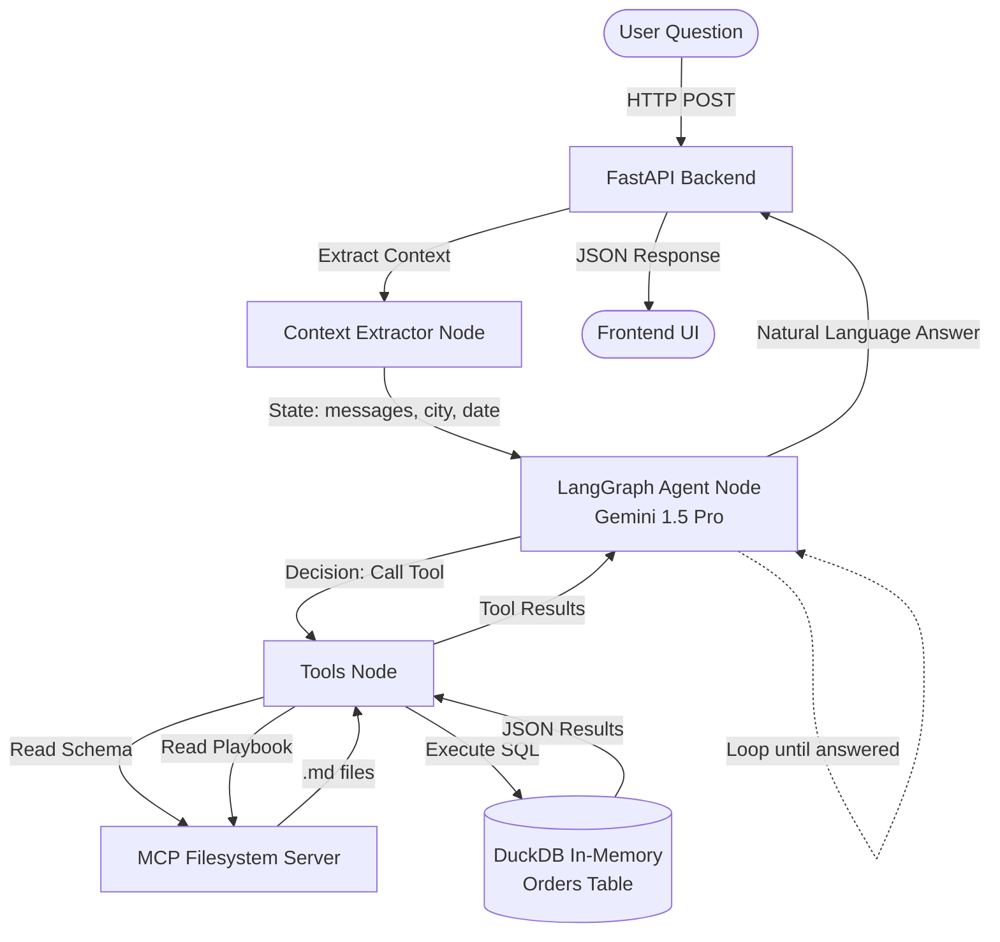

# OR2A RCA Agent

An autonomous, ReAct-style conversational agent for diagnosing delivery SLA breaches (OR2A) across quick-commerce dark stores. 

Built with **LangGraph**, **FastAPI**, **DuckDB**, and **MCP (Model Context Protocol)**. Powered by **Gemini 1.5 Pro**.

---

## 🏗 Architecture & Agent Flow

The agent operates autonomously using a ReAct (Reasoning and Acting) loop. It generates its own SQL, queries the database, and uses MCP to read business logic only when necessary.



---

## 🛠 Prerequisites

- Python 3.11+
- Node.js 18+ (for the MCP filesystem server)
- A **Gemini API Key** (or you can easily swap back to Groq/OpenAI in `app/agent.py`)

---

## 🚀 Setup & Execution

### 1. Clone and enter the project
```bash
cd rca-agent
```

### 2. Create and activate a virtual environment
```bash
python3 -m venv venv
source venv/bin/activate        # Mac/Linux
```

### 3. Install dependencies
```bash
pip install -r requirements.txt
```

### 4. Set your API key
Create a `.env` file and add your Gemini API key:
```bash
echo "GEMINI_API_KEY=your_actual_key_here" > .env
```

### 5. Install the MCP Filesystem Server
The agent uses the official Model Context Protocol server to read documentation dynamically.
```bash
npm install -g @modelcontextprotocol/server-filesystem
```

### 6. Run the Application
Start the FastAPI server (which automatically spins up DuckDB and the MCP subprocess).
```bash
uvicorn app.main:app --reload --port 8000
```

### 7. Open the Chat UI
Navigate to `http://localhost:8000` in your browser.

---

## 🧠 Sample Questions to Test

These exercise the full agent—from basic stats to deep-dive root cause analysis:

1. "How did Bangalore do on 2026-04-22?" *(Agent reads schema, runs aggregation SQL)*
2. "Why did STORE_101 underperform that day?" *(Agent reads RCA Playbook, runs multiple SQL queries to find capacity gaps)*
3. "Walk me through the morning hours at STORE_101."
4. "What exactly is the OR2A metric?" *(Agent calls get_or2a_definition tool)*
5. "What happened at hour 22 there?" *(Agent remembers STORE_101 from context)*

---

## 📂 Project Structure

```text
rca-agent/
├── app/
│   ├── __init__.py
│   ├── main.py          — FastAPI app, static UI serving
│   ├── agent.py         — LangGraph agent, LLM setup, context extraction
│   ├── tools.py         — 4 explicitly defined tools (3 MCP, 1 SQL)
│   ├── database.py      — DuckDB initialization and execution engine
│   └── mcp_docs.py      — MCP filesystem client
├── data/
│   └── quick_commerce_orders_gold_20260422.csv
├── docs/
│   ├── quick_commerce_rca_logic.md
│   ├── quick_commerce_orders_gold.md
│   └── order_ready_to_assignment.md
├── frontend/
│   └── index.html
├── .env
├── requirements.txt
└── README.md
```

---

## 📐 Key Design Decisions

**1. Autonomous Text-to-SQL (ReAct)**  
Instead of hardcoding deterministic Python functions, the agent has a single `run_sql_query` tool. The agent autonomously writes, executes, and iterates on SQL queries based on the user's question. This makes the system infinitely flexible without needing new Python endpoints for new types of questions.

**2. MCP for Business Context**  
The three reference documents (Schema, RCA Playbook, and OR2A definition) are not stuffed into the base System Prompt. Instead, they are exposed as **Tools** via an MCP Server. The agent selectively calls `get_schema_doc` or `get_rca_playbook` only when it needs that specific information, saving massive amounts of tokens and preventing context window overflow.

**Why LangGraph over plain LangChain?** The state graph lets us carry conversation context (current store, city, date) across turns cleanly. When a user asks "what about STORE_102?", the agent reads `current_date` and `current_city` from state without the user re-specifying. The graph structure is: `update_context → agent → (tools → agent)* → END`.

**Tool design — what's a tool vs what's in the prompt vs what's in code:**
- **Tools** (LLM decides *when* to call): `get_city_performance`, `get_store_performance`, `get_hour_detail`, `run_store_rca`, `run_hour_rca`, `list_stores` — all return pre-formatted data, the LLM doesn't write SQL.
- **Deterministic code** (never touches LLM): RCA threshold checks, flag generation, pileup detection — all in `rca.py`.
- **Prompt** (via MCP): Reference docs for context (playbook format, schema, metric definitions). The LLM uses these to interpret results, not to make diagnostic decisions.
